[](https://github.com/Camunda-Community-Hub/community/blob/main/extension-lifecycle.md#stable-)
[](https://github.com/camunda-community-hub/community)


# camunda-8-connector-barcode
Generate a barcode from different format

Different format


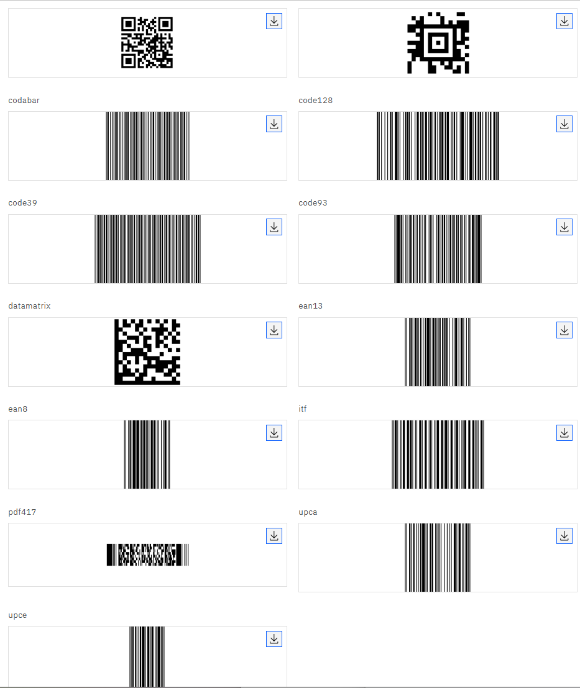

## AZTEC

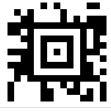

A 2D matrix barcode developed by Andrew Longacre Jr. in 1995. Named after the Aztec pyramid, it uses a bullseye finder pattern at its center, making it compact and readable even without a quiet zone. Commonly used in transport ticketing (e.g. Eurostar, airline boarding passes).

[Wikipedia: Aztec Code](https://en.wikipedia.org/wiki/Aztec_Code)

## CODABAR


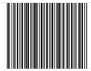

A linear barcode developed in 1972, used primarily in libraries, blood banks, and FedEx. Encodes digits and a small set of special characters. Start/stop characters are letters A–D.

[Wikipedia: Codabar](https://en.wikipedia.org/wiki/Codabar)

## CODE_128


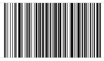

A high-density linear barcode capable of encoding all 128 ASCII characters. Widely used in logistics and supply chain (GS1-128 standard). Supports variable length and is very compact.

[Wikipedia: Code 128](https://en.wikipedia.org/wiki/Code_128)

## CODE_39

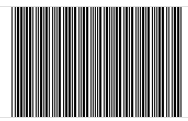

One of the first alphanumeric barcodes (1974). Encodes uppercase letters, digits, and a few special characters. Self-checking and does not require a check digit. Widely used in automotive and defense industries.

[Wikipedia: Code 39](https://en.wikipedia.org/wiki/Code_39)

## CODE_93

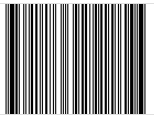

An enhanced version of Code 39 (1982), more compact and supporting the full ASCII character set via a two-character encoding scheme. Includes two check characters for improved reliability.

[Wikipedia: Code 93](https://en.wikipedia.org/wiki/Code_93)

## DATA_MATRIX

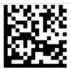

A 2D matrix barcode that can encode large amounts of data in a very small area. Used extensively in electronics manufacturing, aerospace parts marking, and postal services. Supports error correction via Reed-Solomon.

[Wikipedia: Data Matrix](https://en.wikipedia.org/wiki/Data_Matrix)

## EAN_13

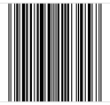

The European Article Number 13-digit standard, an extension of UPC-A used worldwide for retail product identification. The first two or three digits identify the country/region of the issuing authority.

[Wikipedia: International Article Number](https://en.wikipedia.org/wiki/International_Article_Number)

## EAN_8

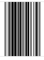

A compact 8-digit version of EAN-13 for small products where a full EAN-13 would not fit (e.g. small packages, cigarettes).

[Wikipedia: EAN-8](https://en.wikipedia.org/wiki/EAN-8)

## ITF

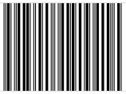

Interleaved 2 of 5 — a numeric-only linear barcode where pairs of digits are interleaved (one in bars, one in spaces). Compact and used in cartons and distribution. Always encodes an even number of digits.

[Wikipedia: Interleaved 2 of 5](https://en.wikipedia.org/wiki/Interleaved_2_of_5)

## PDF_417

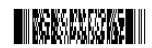


A stacked linear barcode capable of encoding large amounts of data (up to ~1.8 KB). Used on ID cards, driver's licenses, and airline boarding passes. Supports error correction levels 0–8.

[Wikipedia: PDF417](https://en.wikipedia.org/wiki/PDF417)

## QR_CODE


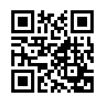

Quick Response code — a 2D matrix barcode invented by Denso Wave in 1994. Extremely popular for URLs, contact info, and payments. Supports four error correction levels (L, M, Q, H) and encodes text, binary, or kanji.

[Wikipedia: QR code](https://en.wikipedia.org/wiki/QR_code)

## UPC_A

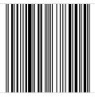

Universal Product Code — the standard 12-digit barcode used on retail products in the US and Canada. The first digit is the number system, followed by 10 data digits and one check digit.

[Wikipedia: Universal Product Code](https://en.wikipedia.org/wiki/Universal_Product_Code)

## UPC_E

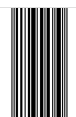

A compressed 8-digit version of UPC-A for small packages, achieved by suppressing zeros. Commonly used on small retail items.

[Wikipedia: Universal Product Code § UPC-E](https://en.wikipedia.org/wiki/Universal_Product_Code#UPC-E)


# Barcode function

Generate a barcode from a code and a barcode format

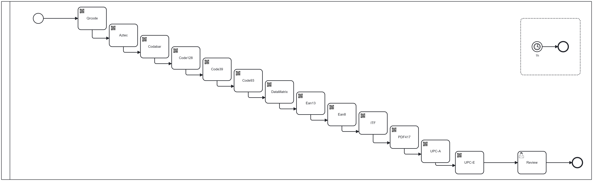

# Save the image

The connector uses the [FileStorage library](https://github.com/camunda-community-hub/camunda-8-connector-filestorage) to save the generated barcode image as a document. This library supports multiple storage backends (folder, S3, Google Drive, Camunda document store, etc.).

## Saving to Camunda document store

To save the image as a Camunda document, set `destinationJsonStorageDefinition` to:

```json
{"type": "CAMUNDA"}
```

The connector output variable (e.g. `destinationFile`) will contain:

```json
{
  "storageDefinition": "CAMUNDA",
  "camundaReference": {
    "storeId": "in-memory",
    "documentId": "d649415c-10fb-48c0-9cfd-d9a8de6e6d9e",
    "contentHash": "0af7f0688d411b2e54748b2195607c9ec8abc4827e328b2963adea72b6ce2d56",
    "metadata": {
      "contentType": "image/png",
      "expiresAt": null,
      "size": 197,
      "fileName": "aztec",
      "processDefinitionId": null,
      "processInstanceKey": null,
      "customProperties": {}
    }
  },
  "fileName": "aztec"
}
```

## Displaying the image in a Camunda Form

Use a **Document Preview** component with the `dataSource` expression:

```feel
=[myVariable.camundaReference]
```

Replace `myVariable` with the name of your output variable (e.g. `=[destinationFile.camundaReference]`).

# Details

## Inputs
| Name                             | Description              | Class            | Level    |
|----------------------------------|--------------------------|------------------|----------|
| code                             | Code                     | java.lang.String | REQUIRED |
| barcodeFormat                    | Barcode Format           | java.lang.String | REQUIRED |
| outputFormat                     | Output format            | java.lang.String | REQUIRED |
| destinationFileName              | Destination file name    | java.lang.String | REQUIRED |
| destinationJsonStorageDefinition | JSon Storage Destination | java.util.Map    | REQUIRED |


## Outputs
| Name            | Description               | Class            | Level    |
|-----------------|---------------------------|------------------|----------|
| destinationFile | Destination variable name | java.lang.String | REQUIRED |


## Errors
| Name                                     | Explanation                                                          |
|------------------------------------------|----------------------------------------------------------------------|
| GENERATION_ERROR                         | During the generation operation                                      |
| SAVE_OPERATION                           | During saved operation                                               |
| INCORRECTSTORAGEDEFINITION               | Definition to access the storage is incorrect                        |
| NO_DESTINATION_STORAGE_DEFINITION_DEFINE | A destination storage must be defined to store the barcode generated |
| BAD_INPUTPARAMETER                       | During the bind, some input does not have the expected type          |

